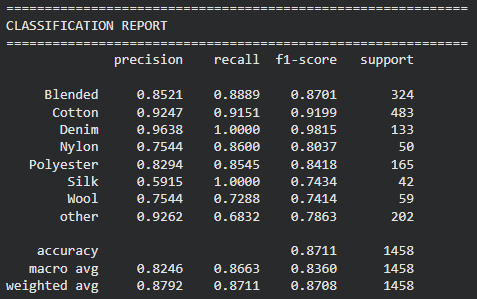
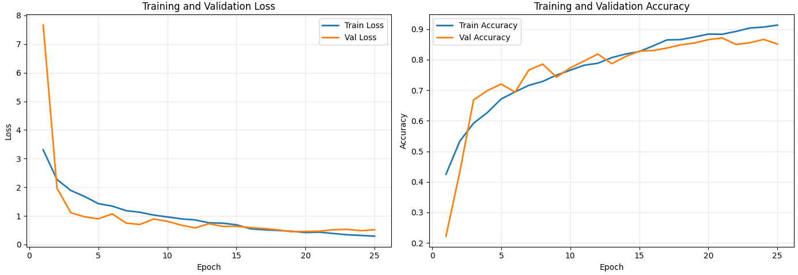
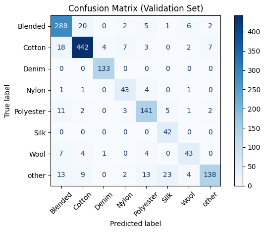

# Fabric Type Classification using ResNet Transfer Learning

## Overview
A deep learning model to classify fabric types from images using ResNet transfer learning.
Built with TensorFlow and Keras as part of a research assistantship at Manchester Metropolitan University.

## Results
- **Accuracy:** 87.1% on 1,458 validation samples
- **Weighted F1-score:** 0.87
- **Classes:** Blended, Cotton, Denim, Nylon, Polyester, Silk, Wool, Other (9 classes)
- Denim recall: 100% | Silk recall: 100%

## Classification Report

## Training Curves

## Confusion Matrix

## Tech Stack
- Python
- TensorFlow / Keras
- ResNet (Transfer Learning)
- Image Augmentation & Preprocessing
